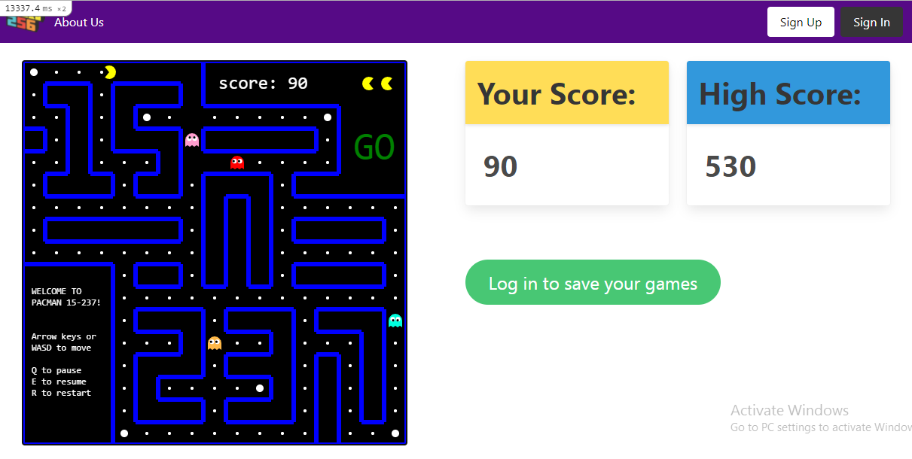

# Rails Pacman webapp
Ruby on rails webapp to play pacman in single player and multiplayer mode. Currently in development.

## Table of contents
* [Description](#description)
* [Prerequisites](#prerequisites)
* [Setup](#setup)
* [Features](#features)
* [Status](#status)
* [Credits](#credits)
* [Screenshots](#screenshots)

## Description
The aim is to create webapp to play pacman in single player and multiplayer mode, maintain statistics of games played, view leaderboards etc. This project was developed to learn Ruby on Rails and concepts of realtime multiplayer gameplaying.  

## Prerequisites
* Ruby 2.7.2
* Rails 6.1.3.1

You can check version using ```ruby -v ``` and ```rails -v```

## Setup

Clone the repository:
```
https://github.com/squarebat/pacman.git
cd pacman
```

Install required gems and webpacker to precompile js files:
```
bundle install
rails webpacker:install
```
If bundler is not installed, you can install it using ```gem install bundler```

Run all database migrations:
```
rails db:migrate
```

Run the server
```
rails s
```
The project is now hosted on ```http://127.0.0.1:3000```

Or, host on a different port using ```rails s -p <port_no>```

## Features

Following features have been implemented:
* Play single player mode Pacman as guest (without user account).
* Create user account and save your games.
* Maintain user game statistics - high score, no of wins total games played etc.
* View Leaderboards (Based on no of total wins, high score and total score).

Following features are currently in development:
* Enabling Multiplayer mode. There are two multiplayer modes:
  1. 2 players will play simultaneously in seperate mazes. The player to eat all pellets first wins, regardless of score. If both players die before eating all pellets, winner is decided based on higher score.
  2. 2-4 players will play in the same maze. Players will receive power pellets randomly which will enable them to eat other players. The one with the highest score wins! 
  
* Adding supercool sound effects to the game.

## Status
Project is currently in development.

## Credits

[ziw/Javascript-Pacman](https://github.com/ziw/Javascript-Pacman) - The javascript files for the pacman gameplay obtained from this repo, were developed by Zi Wang (ziw), Bingying Xia (bxia). The files were further modified for this project.

## Screenshots

